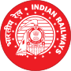

## Project Overview


- Indian Railways  is an Indian state-owned enterprise, owned and operated by the Government of India through the Ministry of Railways. 
- One of the world's largest railway networks comprising 115,000 km (71,000 mi) of track over a route of 65,808 km (40,891 mi) and 7,112 stations.
- In 2014-15, IR carried 8.397 billion passengers annually or more than 23 million passengers a day  and 1058.81 million tons of freight in the year.
-Some Indian Railway  data is available from Indian Governement's Open Data platform
- The passenger and goods train traffic data and Income data are used.
<a href="https://data.gov.in/catalog/financial-position-indian-railways">Financial position of Indian Railways from 2006-07 to 2012-13</a>
- We investigate the contribution of each to the income of Indian Railways
and provide a shiny app for predicting the income based on daily average train traffic(Passenger/Goods) 

--- .class #id 

## Indian Railways Income  at a glance
```{r,results = 'asis', comment = NA, message = F, echo = F}
library(ggplot2)
library(gridExtra)
library(reshape2)
library(rCharts)
irfa<-read.csv("../data/Indian rail traffic net revenues.csv")
h1<-hPlot(x="psgr_trains",y="goods_trains",data=irfa,type='bubble',size="income")
h1$print()

```

--- .class #id


## Prediction algorithm
```{r,echo=FALSE}
fit1<-lm(income~psgr_trains+goods_trains,data=irfa)
fit1$call
fit1$coefficients
```

- Adding one  daily passenger train increases income by 173M INR
- Adding one daily goods train increases income by 279M INR

--- .class #id

## Shiny app UI

