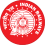
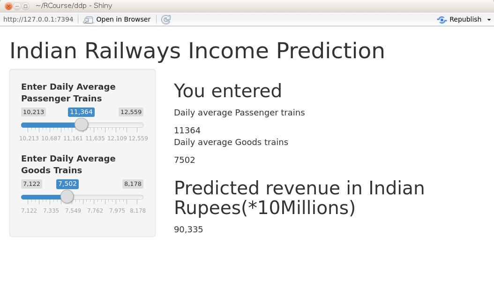

## Project Overview


- Indian Railways  is an Indian state-owned enterprise, owned and operated by the Government of India through the Ministry of Railways. 
- One of the world's largest railway networks comprising 115,000 km (71,000 mi) of track over a route of 65,808 km (40,891 mi) and 7,112 stations.
- In 2014-15, IR carried 8.397 billion passengers annually or more than 23 million passengers a day  and 1058.81 million tons of freight in the year.
-Some Indian Railway  data is available from Indian Governement's Open Data platform
- The passenger and goods train traffic data and Income data are used.
<a href="https://data.gov.in/catalog/financial-position-indian-railways">Financial position of Indian Railways from 2006-07 to 2012-13</a>
- We investigate the contribution of each to the income of Indian Railways
and provide a shiny app for predicting the income based on daily average train traffic(Passenger/Goods) 

--- .class #id 

## Indian Railways Income  at a glance

<div id = 'chart1f9816ca5aa6' class = 'rChart highcharts'></div>
<script type='text/javascript'>
    (function($){
        $(function () {
            var chart = new Highcharts.Chart({
 "dom": "chart1f9816ca5aa6",
"width":            800,
"height":            400,
"credits": {
 "href": null,
"text": null 
},
"exporting": {
 "enabled": false 
},
"title": {
 "text": null 
},
"yAxis": [
 {
 "title": {
 "text": "goods_trains" 
} 
} 
],
"series": [
 {
 "data": [
 [
 10213,
7122,
62731 
],
[
 10368,
7386,
71720 
],
[
 10988,
7530,
79862 
],
[
 11262,
7558,
86964 
],
[
 11824,
7362,
94536 
],
[
 12335,
7375,
103917 
],
[
 12559,
8178,
132552 
] 
],
"type": "bubble",
"marker": {
 "radius":              3 
} 
} 
],
"legend": {
 "enabled": false 
},
"xAxis": [
 {
 "title": {
 "text": "psgr_trains" 
} 
} 
],
"subtitle": {
 "text": null 
},
"id": "chart1f9816ca5aa6",
"chart": {
 "renderTo": "chart1f9816ca5aa6" 
} 
});
        });
    })(jQuery);
</script>

--- .class #id


## Prediction algorithm

```
## lm(formula = income ~ psgr_trains + goods_trains, data = irfa)
```

```
##   (Intercept)   psgr_trains  goods_trains 
## -316759.50987      17.39792      27.91056
```

- Adding one  daily passenger train increases income by 170M INR
- Adding one daily goods train increases income by 279M INR

--- .class #id

## Shiny app UI

